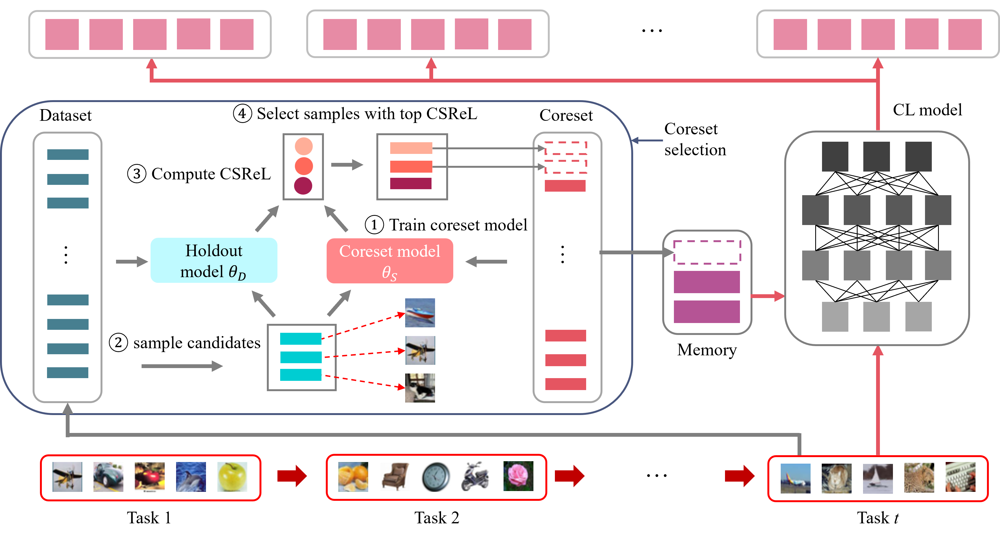

# Coreset Selection via Reducible Loss in Continual Learning

<p align="center">

</p>

<p align="center">
  <a href="abstract"> Abstract</a> •
  <a href="data-preparation"> Data preparation</a> •
  <a href="run-experiments"> Running experiments</a> •
  <a href="citation"> Citation</a>
</p>

---

[](https://openreview.net/forum?id=mAztx8QO3B)
[](https://github.com/RuilinTong/CSReL-Coreset-CL/blob/main/LICENSE)


## Abstract <a id="abstract"></a>
A natural solution for rehearsal-based continual learning is to select a coreset as memory. A coreset serves as an informative summary of a large dataset, enabling a model trained solely on the coreset to achieve performance comparable to training on the full dataset. Previous bi-level coreset selection methods adjust sample weights or probabilities to minimize the outer loss, which is computed over the entire dataset. For non-representative samples like ambiguous or noisy samples, since these samples are not well learned even training model on the full dataset, loss of these samples in the outer loss are not worthy to be reduced. However, their high loss values may cause them to be selected in an attempt to minimize the outer loss, which may lead to suboptimal performance for models trained on the coreset. To address this issue, we first investigate how the performance of a trained model changes when a sample is added to the training dataset and approximate this performance gain using reducible loss. We then select samples with the highest performance gain in the coreset so that performance of model trained on coreset could be maximized. We show that samples with high performance gain are informative and representative. Furthermore, reducible loss requires only forward computation, making it significantly more efficient than previous methods. To better apply coreset selection in continual learning, we extend our method to address key challenges such as task interference, streaming data, and knowledge distillation. Experiments on data summarization and continual learning demonstrate the effectiveness and efficiency of our approach.

## Setup
- This implementation requires python 3.9.18.
- To install the required dependencies, please run: `pip3 install -r requirements.txt`

## Data preparation <a id="data-preparation"></a>
- Tiny-ImageNet in our experiments is downloaded from [mammoth implementation](https://github.com/aimagelab/mammoth/tree/master).
- To download Tiny-ImageNet, please run:

```
cd data_preparation/
bash tiny_download.sh
```

## Run experiments <a id="run-experiments"></a>

### Data summarization

- To reimplement results of data summarization, please run scripts: `bash scripts/run_sum_{dataset}.sh`.
- `{dataset}` could be `mnist`, `cifar10` and `cifar100` in our implementation.

### Continual learning in Table 1

- To reimplement CSRL-CL results in Table 1, please run scripts: `bash scripts/run_{dataset}.sh`.
- To reimplement CSRL-CL-prv results in Table 1, please run scripts: `bash scripts/run_{dataset}_prv.sh`.
- `{dataset}` could be `perm`, `mnist`, `cifar` and `cifar100` in our implementation.

### Continual learning in Table 2

- To reimplement CSRL-DER++ results in Table 2, please run scripts: `bash scripts/run_stream_{dataset}_{buffer_size}.sh`.
- To reimplement CSRL-LODE-DER++ results in Table 2, please run scripts: `bash scripts/run_stream_lode_{dataset}_{buffer_size}.sh`.
- `{dataset}` could be `cifar100` and `tiny` in our implementation, and `{buffer_size}` could be `200` and `500`.

**Note:** Some experiments in this project are sensitive to random seeds, which may lead to variations in the results. We recommend running the experiments with multiple seeds to obtain reliable average performance. You can specify the seed using the `--seed` argument in the script.

## Citation  <a id="citation"></a>

If you find our work helpful, please cite our paper by the following reference:

```
@inproceedings{author2025title,
  title={Coreset Selection via Reducible Loss in Continual Learning},
  author={Ruilin Tong, Yuhang Liu, Javen Qinfeng Shi, Dong Gong},
  booktitle={Proceedings of the International Conference on Learning Representations (ICLR)},
  year={2025},
  url={https://openreview.net/forum?id=mAztx8QO3B},
}
```
